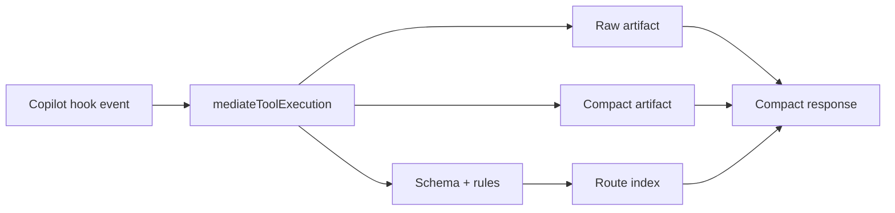

# Architecture

UTK is a mediation layer between GitHub Copilot tool events and model-visible responses. The full tool result is preserved on disk, while chat receives a compact response with recovery references and schema/routing metadata.

## Data Flow

1. A Copilot hook or host integration observes a tool id, tool input, and tool output.
2. `mediateToolExecution` persists the raw output under `.utk/tools/<tool-id>/observations/<run-id>/`.
3. UTK infers an output schema and generic structural rules.
4. The schema is merged into per-tool history and route indexes.
5. A configured serializer writes a compact artifact.
6. The caller receives a short response that references the raw and compact artifacts.

## Core Principles

- **Hook-first:** UTK is designed for tool hooks, not for direct end-user CLI usage.
- **Payload safe:** raw payloads are written to disk and omitted from chat context.
- **Recoverable:** compact responses always point back to raw artifacts.
- **Generalized:** schema inference and routing are based on shape, not command-specific special cases.
- **Measurable:** RTK parity metrics enforce savings, fact retention, and artifact recovery.

## Runtime Packages

- `@utk/core` owns mediation, config, persistence, serializers, schemas, routing, and recovery artifacts.
- `@utk/copilot-hook` adapts Copilot hook JSON to core mediation.
- `@utk/constrained-decoder` owns `guidance-ts` route grammar helpers.
- `@utk/evals` owns parity fixtures, metrics, and assertions.

## Related Docs

- [Quickstart](quickstart.md)
- [Copilot Hook Integration](copilot-hook.md)
- [Artifacts And Recovery](artifacts.md)
- [RTK Parity](rtk-parity.md)
