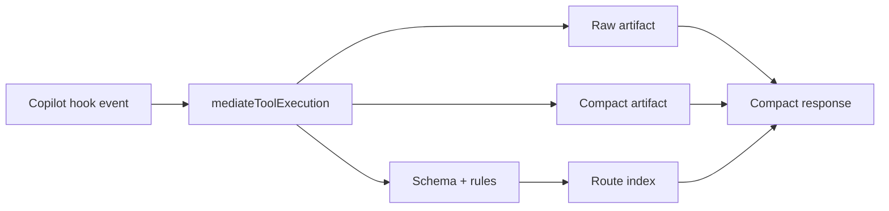

# Architecture

UTK is a mediation layer between GitHub Copilot tool events and model-visible responses. The full tool result is preserved on disk, while chat receives a compact response with recovery references and schema/routing metadata.

## Data Flow

1. A Copilot hook or host integration observes a tool id, tool input, and tool output.
2. `mediateToolExecution` writes the raw input under `.utk/tools/<tool-id>/observations/<run-id>/input.json`.
3. UTK optionally writes `input.detok.json` when local LLMLingua-2 compression applies to LLM-bound input text.
4. The original tool output is persisted as `output.raw.json`, `output.raw.txt`, or `output.raw.bin`.
5. UTK infers an output schema and generic structural rules from the raw output or binary/stream envelope.
6. The schema is merged into per-tool history and route indexes.
7. A configured serializer writes a compact artifact in TOON or compressed JSON.
8. The caller receives a short response that references the raw and compact artifacts.

## Core Principles

- **Hook-first:** UTK mediation is designed for tool hooks, not for direct end-user CLI usage.
- **Local detok helper:** the `detok` MCP server is a local LLMLingua-2 text rewriting helper, not a replacement mediation surface.
- **Payload safe:** raw payloads are written to disk and omitted from chat context.
- **Recoverable:** compact responses always point back to raw artifacts.
- **Generalized:** schema inference and routing are based on shape, not command-specific special cases.
- **Measurable:** RTK, Caveman, Compresr, and LeanCTX Copilot benchmarks enforce savings plus fact retention, recoverability, relevance, correctness, groundedness, and edge-case gates.
- **Generated reuse:** `utk-init` can materialize dynamic session agents and session skills under `.utk/` so repeated project work is referenced instead of re-explained.

## Optional Tracing Pipeline

Every step in the data flow above can emit a [agentevals.io](https://agentevals.io)-compatible Jaeger span when `[tracing] enabled = true` in `.utk/config.toml`. The mediator opens a root `utk.mediate` span and a child `tool.<id>` span; downstream sites (`structuredTooling`, `lintPack`, `loadPack`, `templateRuntime`, `router`, `llmlingua2`) attach failure logs via `recordFailure`. Artifacts land in `.utk/events/<run-id>.{jaeger.json,eval_set.json}` and feed the agentevals-driven TDD harness in `@utk/evals`. See [Tracing](tracing.md) for the overview and [Evals-Driven Iteration](evals-driven-iteration.md) for the baseline loop.

## Integration Surfaces

UTK currently exposes several surfaces with different constraints:

| Surface | Purpose | Public CLI? |
|---|---|---:|
| `@utk/core` | Mediation, artifacts, serializers, config, bash-like templates, tracing, session agent/skill generation. | No |
| `@utk/copilot-hook` | GitHub Copilot hook payload adapters and the internal `preToolUse` detok runner. | No |
| `@utk/constrained-decoder` | `guidance-ts` grammar helpers for constrained route fallback (carries a `tracer?` DI seam to avoid a core cycle). | No |
| `@utk/detok-mcp` | Private local MCP server exposing LLMLingua-2 rewriting as `detok`. | MCP only |
| `@utk/evals` | Fixture-backed parity, safety, bash rewrite, and agentevals.io evaluators / baselines. | No |

## Runtime Packages

- `@utk/core` owns mediation, config, persistence, serializers, schemas, routing, recovery artifacts, and the tracing module.
- `@utk/copilot-hook` adapts Copilot hook JSON to core mediation.
- `@utk/constrained-decoder` owns `guidance-ts` route grammar helpers.
- `@utk/detok-mcp` owns the private local stdio MCP server for the `detok` tool.
- `@utk/evals` owns parity fixtures, metrics, agentevals.io evaluators, and the baseline store.

## Related Docs

- [Quickstart](quickstart.md)
- [Copilot Hook Integration](copilot-hook.md)
- [Artifacts And Recovery](artifacts.md)
- [Bash-Like Tool Templates](bash-like-tool.md)
- [Session Agents And Skills](session-artifacts.md)
- [Tracing](tracing.md)
- [Evals-Driven Iteration](evals-driven-iteration.md)
- [RTK Parity](rtk-parity.md)
- [Internal Benchmark Summary](internal/benchmark-summary.md)
