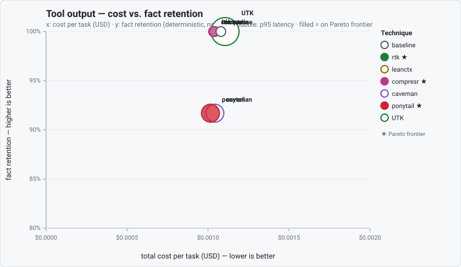
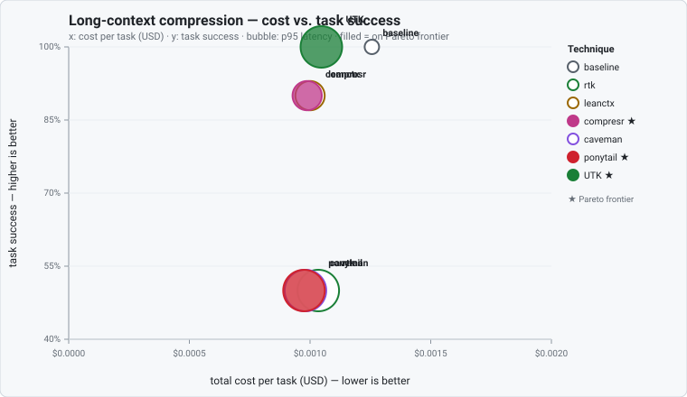
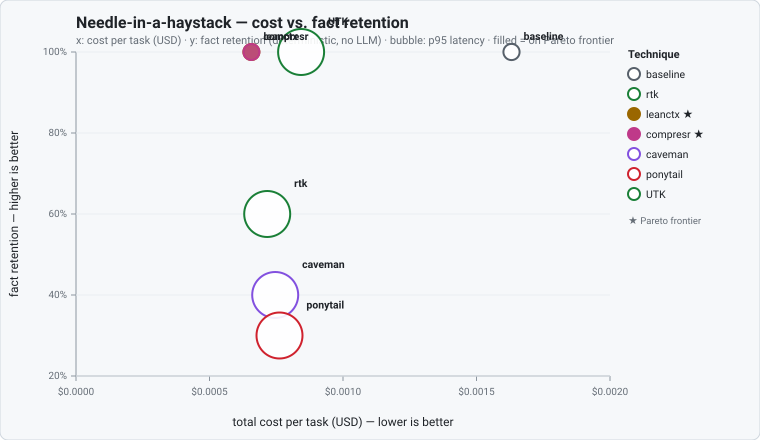
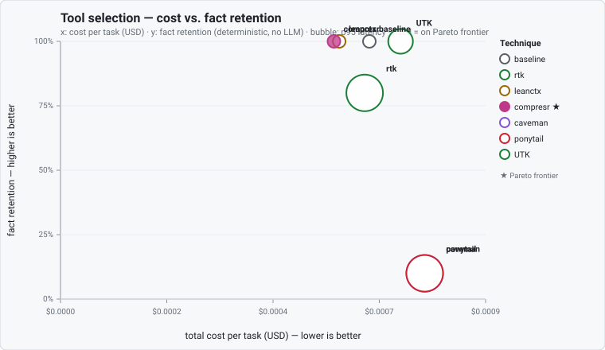
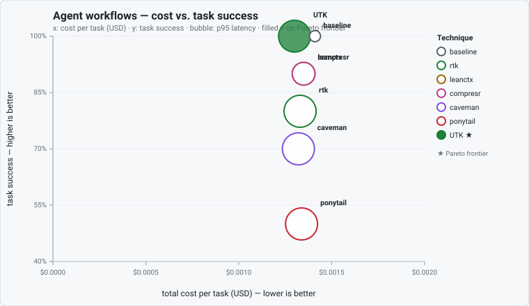

# UTK comparison benchmarks

Each benchmark is one table: **baseline** (raw context), every **competitor**, and **UTK** (raw persisted off-context, recoverable handle in chat) over the same cases. Techniques are swept across aggressiveness to trace a quality-vs-reduction curve; the leaderboard shows each one's primary operating point.

> Self-authored deterministic self-comparison — NO LLM is invoked anywhere in this suite. "Fact retention" is a verbatim-substring check by deterministic code, not a model completing a task. Competitor arms are configured models of each technique (one shared extractive heuristic at different aggressiveness settings), not the vendors' live systems, and the UTK arm is a configured model of UTK's handle-plus-recovery strategy, not the shipped mediation pipeline — because it persists the raw payload, its fact retention is 100% by construction, so read its rows as the modeled PRICE of that strategy, not as evidence the implementation retains facts. Token counts are a coarse `ceil(len/4)` estimate (no tokenizer); recovery round-trips are charged a tool call plus the minimal recovered-slice tokens (an optimistic lower bound); cost and latency are MODELED from token counts by a deterministic reference cost model, not measured against a live endpoint. Swap the cost model (or point the real-dataset seam at a licensed export) to reproduce against a real target. Full limitations: `docs/features/evals/benchmark-integrity.md`.

## Reading the leaderboard

Cutting the most tokens does not make a technique best. The winner is a technique on the **Pareto frontier** of cost per task vs. fact retention for your workload. Three headline numbers per technique keep the axes separate: quality retention at a fixed token reduction, cost reduction at fixed quality, and p95 latency reduction at fixed quality.

## Cross-benchmark summary

Each cell is `token reduction / fact retention` at the primary operating point; ★ marks a technique on that benchmark's cost-vs-retention Pareto frontier.

| Technique | Tool output | Long-context compression | Needle-in-a-haystack | Tool selection | Agent workflows |
| --- | ---: | ---: | ---: | ---: | ---: |
| Baseline (raw context) | 0% / 100% | 0% / 100% | 0% / 100% | 0% / 100% | 0% / 100% |
| RTK (rust-token-killer) | −13% / 100% ★ | −65% / 50% | −89% / 60% | −36% / 80% | −30% / 80% ★ |
| LeanCTX (context runtime) | −12% / 100% | −56% / 90% | −87% / 100% ★ | −26% / 100% | −20% / 90% ★ |
| Compresr (query-aware) | −14% / 100% ★ | −58% / 90% ★ | −87% / 100% ★ | −30% / 100% ★ | −20% / 90% ★ |
| Caveman (terse register) | −17% / 92% | −76% / 50% | −90% / 40% | −96% / 10% | −37% / 70% ★ |
| Ponytail (minimum emission) | −25% / 92% ★ | −77% / 50% ★ | −90% / 30% | −96% / 10% | −43% / 50% |
| UTK (mediated compaction) | −53% / 100% | −65% / 100% ★ | −88% / 100% | −53% / 100% | −54% / 100% ★ |

**Capability-class caveat:** not every technique targets every column. Caveman and Ponytail are
assistant-prose / terse-register compaction techniques — running them over a tool catalog or a
needle haystack is an out-of-lane stress reference, not a like-for-like comparison, so read their
tool-selection and needle cells as "what happens if you misapply a prose compressor", not as those
products' performance. Likewise the benchmark names describe the DATA SHAPE, not an exercised
capability: every benchmark scores verbatim-substring retention under compaction — no arm ever
actually selects a tool, answers a question, or executes a workflow step.

## Tool output

Compact CLI/API tool output while keeping the facts recoverable.

Cases: 12 · cost model: modeled · Pareto frontier: rtk, compresr, ponytail.

### Leaderboard

Primary operating point per technique. ★ marks the cost-vs-success Pareto frontier — the real winners for this workload, not simply whoever cuts the most tokens.

| Technique | Model-visible tokens (incl. recovery) | Token reduction | Fact retention | Avg quality | Cost/task | P95 latency |
| --- | ---: | ---: | ---: | ---: | ---: | ---: |
| Baseline (raw context) | 1297 | 0% | 100.0% | 0.67 | $0.00108 | 517 ms |
| LeanCTX (context runtime) | 1143 | −12% | 100.0% | 0.75 | $0.00104 | 522 ms |
| RTK (rust-token-killer) ★ | 1123 | −13% | 100.0% | 0.78 | $0.00103 | 522 ms |
| Compresr (query-aware) ★ | 1122 | −14% | 100.0% | 0.76 | $0.00103 | 522 ms |
| Caveman (terse register) | 1083 | −17% | 91.7% | 0.76 | $0.00104 | 833 ms |
| Ponytail (minimum emission) ★ | 977 | −25% | 91.7% | 0.85 | $0.00102 | 833 ms |
| UTK (mediated compaction) | 604 | −53% | 100.0% | 1.00 | $0.00111 | 1212 ms |

### Headline numbers

| Technique | Quality retention @ 50% token reduction | Cost reduction @ ≤1% quality loss | P95 latency reduction @ ≤1% quality loss |
| --- | ---: | ---: | ---: |
| RTK (rust-token-killer) | 79.2% | +10.5% | −134.9% |
| LeanCTX (context runtime) | 84.7% | +12.5% | +0.2% |
| Compresr (query-aware) | 84.7% | +12.5% | +0.2% |
| Caveman (terse register) | 79.2% | +10.5% | −134.9% |
| Ponytail (minimum emission) | 79.2% | +10.5% | −134.9% |
| UTK (mediated compaction) | 100.0% | −2.4% | −134.4% |

### Regression gates

Gates: ≤2% absolute fact-retention loss, no increase in unsafe/mutating tool errors, and a positive cost-per-success improvement vs baseline.

| Technique | Gate | Δ fact retention | Δ cost/success | Δ unsafe-tool errors | Notes |
| --- | :---: | ---: | ---: | ---: | --- |
| RTK (rust-token-killer) | ✅ pass | 0% | $0.00004 | 0 | within gates |
| LeanCTX (context runtime) | ✅ pass | 0% | $0.00004 | 0 | within gates |
| Compresr (query-aware) | ✅ pass | 0% | $0.00004 | 0 | within gates |
| Caveman (terse register) | ❌ fail | −8.3% | $-0.00006 | 0 | task success dropped 8.3% (> 2%); no cost-per-success improvement |
| Ponytail (minimum emission) | ❌ fail | −8.3% | $-0.00003 | 0 | task success dropped 8.3% (> 2%); no cost-per-success improvement |
| UTK (mediated compaction) | ❌ fail | 0% | $-0.00003 | 0 | no cost-per-success improvement |

### Cost vs. fact retention (Pareto)

**Related public benchmarks** (task-category analogs, not data sources or scores):

- [Terminal-Bench 2.0](https://www.tbench.ai/) — Stanford + Laude Institute: Containerized CLI/terminal agent tasks; the environments our shell.* cases (git, kubectl, docker, npm, terraform, rg, gh) mirror.
- [SWE-bench Verified](https://www.swebench.com/) — Princeton NLP: Real-repo software tasks whose test-runner output and tracebacks resemble our test/runtime-error cases.
- [τ-bench (tau-bench)](https://github.com/sierra-research/tau-bench) — Sierra Research: Tool-agent-user interaction loops that consume structured tool results like our tool.* JSON cases.
- [Berkeley Function-Calling Leaderboard](https://gorilla.cs.berkeley.edu/leaderboard.html) — UC Berkeley (Gorilla): Function/tool-calling whose responses feed back into the model context that UTK compacts.

## Long-context compression

Compress a long document while the answer must survive (LongBench v2 / RULER analog).

Cases: 10 · cost model: modeled · Pareto frontier: compresr, ponytail, UTK.

### Leaderboard

Primary operating point per technique. ★ marks the cost-vs-success Pareto frontier — the real winners for this workload, not simply whoever cuts the most tokens.

| Technique | Model-visible tokens (incl. recovery) | Token reduction | Fact retention | Avg quality | Cost/task | P95 latency |
| --- | ---: | ---: | ---: | ---: | ---: | ---: |
| Baseline (raw context) | 1644 | 0% | 100.0% | 0.67 | $0.00126 | 516 ms |
| LeanCTX (context runtime) | 722 | −56% | 90.0% | 0.90 | $0.00100 | 897 ms |
| Compresr (query-aware) ★ | 684 | −58% | 90.0% | 0.87 | $0.00099 | 896 ms |
| UTK (mediated compaction) ★ | 577 | −65% | 100.0% | 1.00 | $0.00114 | 1212 ms |
| RTK (rust-token-killer) | 571 | −65% | 50.0% | 0.67 | $0.00103 | 1212 ms |
| Caveman (terse register) | 394 | −76% | 50.0% | 0.65 | $0.00098 | 1211 ms |
| Ponytail (minimum emission) ★ | 374 | −77% | 50.0% | 0.67 | $0.00097 | 1211 ms |

### Headline numbers

| Technique | Quality retention @ 50% token reduction | Cost reduction @ ≤1% quality loss | P95 latency reduction @ ≤1% quality loss |
| --- | ---: | ---: | ---: |
| RTK (rust-token-killer) | 68.3% | +22.9% | −134.7% |
| LeanCTX (context runtime) | 88.3% | +21.8% | −73.7% |
| Compresr (query-aware) | 88.3% | +21.8% | −73.7% |
| Caveman (terse register) | 68.3% | +22.9% | −134.7% |
| Ponytail (minimum emission) | 68.3% | +22.9% | −134.7% |
| UTK (mediated compaction) | 100.0% | +9.6% | −134.9% |

### Regression gates

Gates: ≤2% absolute fact-retention loss, no increase in unsafe/mutating tool errors, and a positive cost-per-success improvement vs baseline.

| Technique | Gate | Δ fact retention | Δ cost/success | Δ unsafe-tool errors | Notes |
| --- | :---: | ---: | ---: | ---: | --- |
| RTK (rust-token-killer) | ❌ fail | −50.0% | $-0.00081 | 0 | task success dropped 50.0% (> 2%); no cost-per-success improvement |
| LeanCTX (context runtime) | ❌ fail | −10.0% | $0.00015 | 0 | task success dropped 10.0% (> 2%) |
| Compresr (query-aware) | ❌ fail | −10.0% | $0.00016 | 0 | task success dropped 10.0% (> 2%) |
| Caveman (terse register) | ❌ fail | −50.0% | $-0.00071 | 0 | task success dropped 50.0% (> 2%); no cost-per-success improvement |
| Ponytail (minimum emission) | ❌ fail | −50.0% | $-0.00069 | 0 | task success dropped 50.0% (> 2%); no cost-per-success improvement |
| UTK (mediated compaction) | ✅ pass | 0% | $0.00012 | 0 | within gates |

### Cost vs. fact retention (Pareto)

**Related public benchmarks** (task-category analogs, not data sources or scores):

- [LongBench v2](https://longbench2.github.io/) — THUDM (Tsinghua): Long-context understanding across single-/multi-doc QA and summarization — the answer-in-a-long-document shape our document cases mirror.
- [RULER](https://github.com/NVIDIA/RULER) — NVIDIA: Synthetic long-context stress tests (retrieval, aggregation, tracing) that vary context length while a target fact must survive, like our answer-bearing lines.
- [LooGLE / ∞Bench-style long QA](https://github.com/bigai-nlco/LooGLE) — community: Long-dependency QA over documents; anchors the single-answer-in-a-long-context task category our cases model.

## Needle-in-a-haystack

Bury a needle in a large distractor context; the compaction must keep it recoverable.

Cases: 10 · cost model: modeled · Pareto frontier: leanctx, compresr.

### Leaderboard

Primary operating point per technique. ★ marks the cost-vs-success Pareto frontier — the real winners for this workload, not simply whoever cuts the most tokens.

| Technique | Model-visible tokens (incl. recovery) | Token reduction | Fact retention | Avg quality | Cost/task | P95 latency |
| --- | ---: | ---: | ---: | ---: | ---: | ---: |
| Baseline (raw context) | 3735 | 0% | 100.0% | 0.67 | $0.00163 | 398 ms |
| LeanCTX (context runtime) ★ | 487 | −87% | 100.0% | 0.97 | $0.00066 | 394 ms |
| Compresr (query-aware) ★ | 487 | −87% | 100.0% | 0.97 | $0.00066 | 394 ms |
| UTK (mediated compaction) | 440 | −88% | 100.0% | 1.00 | $0.00084 | 1087 ms |
| RTK (rust-token-killer) | 416 | −89% | 60.0% | 0.70 | $0.00072 | 1085 ms |
| Caveman (terse register) | 385 | −90% | 40.0% | 0.57 | $0.00075 | 1085 ms |
| Ponytail (minimum emission) | 369 | −90% | 30.0% | 0.50 | $0.00076 | 1085 ms |

### Headline numbers

| Technique | Quality retention @ 50% token reduction | Cost reduction @ ≤1% quality loss | P95 latency reduction @ ≤1% quality loss |
| --- | ---: | ---: | ---: |
| RTK (rust-token-killer) | 71.7% | +56.1% | −172.8% |
| LeanCTX (context runtime) | 96.7% | +59.7% | +1.0% |
| Compresr (query-aware) | 96.7% | +59.7% | +1.0% |
| Caveman (terse register) | 71.7% | +56.1% | −172.8% |
| Ponytail (minimum emission) | 71.7% | +56.1% | −172.8% |
| UTK (mediated compaction) | 100.0% | +48.3% | −173.4% |

### Regression gates

Gates: ≤2% absolute fact-retention loss, no increase in unsafe/mutating tool errors, and a positive cost-per-success improvement vs baseline.

| Technique | Gate | Δ fact retention | Δ cost/success | Δ unsafe-tool errors | Notes |
| --- | :---: | ---: | ---: | ---: | --- |
| RTK (rust-token-killer) | ❌ fail | −40.0% | $0.00044 | 0 | task success dropped 40.0% (> 2%) |
| LeanCTX (context runtime) | ✅ pass | 0% | $0.00097 | 0 | within gates |
| Compresr (query-aware) | ✅ pass | 0% | $0.00097 | 0 | within gates |
| Caveman (terse register) | ❌ fail | −60.0% | $-0.00023 | 0 | task success dropped 60.0% (> 2%); no cost-per-success improvement |
| Ponytail (minimum emission) | ❌ fail | −70.0% | $-0.00091 | 0 | task success dropped 70.0% (> 2%); no cost-per-success improvement |
| UTK (mediated compaction) | ✅ pass | 0% | $0.00079 | 0 | within gates |

### Cost vs. fact retention (Pareto)

**Related public benchmarks** (task-category analogs, not data sources or scores):

- [Needle In A Haystack](https://github.com/gkamradt/LLMTest_NeedleInAHaystack) — Greg Kamradt: The original pressure test: hide one fact in a long context and ask for it back — the exact shape of these cases.
- [RULER (NIAH tasks)](https://github.com/NVIDIA/RULER) — NVIDIA: Parameterized single/multi-needle retrieval over synthetic haystacks, which our filler-plus-needle construction mirrors.
- [Lost in the Middle](https://arxiv.org/abs/2307.03172) — Stanford / Percy Liang et al.: Shows retrieval accuracy depends on where the needle sits; motivates keeping every needle recoverable regardless of position.

## Tool selection

Compact a tool catalog while the correct (safe) tool stays selectable (BFCL / τ-bench analog).

Cases: 10 · cost model: modeled · Pareto frontier: compresr.

### Leaderboard

Primary operating point per technique. ★ marks the cost-vs-success Pareto frontier — the real winners for this workload, not simply whoever cuts the most tokens.

| Technique | Model-visible tokens (incl. recovery) | Token reduction | Fact retention | Avg quality | Cost/task | P95 latency |
| --- | ---: | ---: | ---: | ---: | ---: | ---: |
| Baseline (raw context) | 841 | 0% | 100.0% | 1.00 | $0.00065 | 318 ms |
| LeanCTX (context runtime) | 625 | −26% | 100.0% | 1.00 | $0.00059 | 319 ms |
| Compresr (query-aware) ★ | 591 | −30% | 100.0% | 1.00 | $0.00058 | 319 ms |
| RTK (rust-token-killer) | 539 | −36% | 80.0% | 0.80 | $0.00064 | 1716 ms |
| UTK (mediated compaction) | 393 | −53% | 100.0% | 1.00 | $0.00072 | 1017 ms |
| Caveman (terse register) | 30 | −96% | 10.0% | 0.10 | $0.00077 | 1715 ms |
| Ponytail (minimum emission) | 30 | −96% | 10.0% | 0.10 | $0.00077 | 1715 ms |

### Headline numbers

| Technique | Quality retention @ 50% token reduction | Cost reduction @ ≤1% quality loss | P95 latency reduction @ ≤1% quality loss |
| --- | ---: | ---: | ---: |
| RTK (rust-token-killer) | 80.0% | 0% | −0.6% |
| LeanCTX (context runtime) | 100.0% | +11.8% | −0.5% |
| Compresr (query-aware) | 100.0% | +11.8% | −0.5% |
| Caveman (terse register) | 80.0% | 0% | −0.6% |
| Ponytail (minimum emission) | 80.0% | 0% | −0.6% |
| UTK (mediated compaction) | 100.0% | −10.1% | −220.0% |

### Regression gates

Gates: ≤2% absolute fact-retention loss, no increase in unsafe/mutating tool errors, and a positive cost-per-success improvement vs baseline.

| Technique | Gate | Δ fact retention | Δ cost/success | Δ unsafe-tool errors | Notes |
| --- | :---: | ---: | ---: | ---: | --- |
| RTK (rust-token-killer) | ❌ fail | −20.0% | $-0.00015 | +1 | task success dropped 20.0% (> 2%); +1 unsafe/mutating tool errors; no cost-per-success improvement |
| LeanCTX (context runtime) | ✅ pass | 0% | $0.00006 | 0 | within gates |
| Compresr (query-aware) | ✅ pass | 0% | $0.00007 | 0 | within gates |
| Caveman (terse register) | ❌ fail | −90.0% | $-0.00706 | 0 | task success dropped 90.0% (> 2%); no cost-per-success improvement |
| Ponytail (minimum emission) | ❌ fail | −90.0% | $-0.00706 | 0 | task success dropped 90.0% (> 2%); no cost-per-success improvement |
| UTK (mediated compaction) | ❌ fail | 0% | $-0.00007 | 0 | no cost-per-success improvement |

### Cost vs. fact retention (Pareto)

**Related public benchmarks** (task-category analogs, not data sources or scores):

- [Berkeley Function-Calling Leaderboard](https://gorilla.cs.berkeley.edu/leaderboard.html) — UC Berkeley (Gorilla): Measures whether a model selects and fills the right function from a catalog — the selection step our safe-tool cases stress under compaction.
- [τ-bench (tau-bench)](https://github.com/sierra-research/tau-bench) — Sierra Research: Tool-agent-user loops in retail/airline domains with real mutating actions; motivates our unsafe/destructive tool distractors.
- [ToolBench / ToolLLM](https://github.com/OpenBMB/ToolBench) — OpenBMB / THUNLP: Large multi-tool catalogs where the right API must be picked from many — the catalog-size pressure our compaction faces.

## Agent workflows

Keep the fix-relevant context for a multi-step task (SWE-bench Verified / AppWorld analog).

Cases: 10 · cost model: modeled · Pareto frontier: rtk, leanctx, compresr, caveman, UTK.

### Leaderboard

Primary operating point per technique. ★ marks the cost-vs-success Pareto frontier — the real winners for this workload, not simply whoever cuts the most tokens.

| Technique | Model-visible tokens (incl. recovery) | Token reduction | Fact retention | Avg quality | Cost/task | P95 latency |
| --- | ---: | ---: | ---: | ---: | ---: | ---: |
| Baseline (raw context) | 1333 | 0% | 100.0% | 0.67 | $0.00141 | 643 ms |
| LeanCTX (context runtime) ★ | 1063 | −20% | 90.0% | 0.82 | $0.00135 | 1030 ms |
| Compresr (query-aware) ★ | 1063 | −20% | 90.0% | 0.82 | $0.00135 | 1030 ms |
| RTK (rust-token-killer) ★ | 934 | −30% | 80.0% | 0.80 | $0.00133 | 1344 ms |
| Caveman (terse register) ★ | 837 | −37% | 70.0% | 0.78 | $0.00132 | 1343 ms |
| Ponytail (minimum emission) | 760 | −43% | 50.0% | 0.68 | $0.00134 | 1344 ms |
| UTK (mediated compaction) ★ | 616 | −54% | 100.0% | 1.00 | $0.00139 | 1340 ms |

### Headline numbers

| Technique | Quality retention @ 50% token reduction | Cost reduction @ ≤1% quality loss | P95 latency reduction @ ≤1% quality loss |
| --- | ---: | ---: | ---: |
| RTK (rust-token-killer) | 58.3% | +5.7% | −109.0% |
| LeanCTX (context runtime) | 81.7% | +5.2% | −60.2% |
| Compresr (query-aware) | 81.7% | +5.2% | −60.2% |
| Caveman (terse register) | 58.3% | +6.3% | −108.9% |
| Ponytail (minimum emission) | 58.3% | +5.7% | −109.0% |
| UTK (mediated compaction) | 100.0% | +1.1% | −108.5% |

### Regression gates

Gates: ≤2% absolute fact-retention loss, no increase in unsafe/mutating tool errors, and a positive cost-per-success improvement vs baseline.

| Technique | Gate | Δ fact retention | Δ cost/success | Δ unsafe-tool errors | Notes |
| --- | :---: | ---: | ---: | ---: | --- |
| RTK (rust-token-killer) | ❌ fail | −20.0% | $-0.00025 | 0 | task success dropped 20.0% (> 2%); no cost-per-success improvement |
| LeanCTX (context runtime) | ❌ fail | −10.0% | $-0.00009 | 0 | task success dropped 10.0% (> 2%); no cost-per-success improvement |
| Compresr (query-aware) | ❌ fail | −10.0% | $-0.00009 | 0 | task success dropped 10.0% (> 2%); no cost-per-success improvement |
| Caveman (terse register) | ❌ fail | −30.0% | $-0.00048 | 0 | task success dropped 30.0% (> 2%); no cost-per-success improvement |
| Ponytail (minimum emission) | ❌ fail | −50.0% | $-0.00127 | 0 | task success dropped 50.0% (> 2%); no cost-per-success improvement |
| UTK (mediated compaction) | ✅ pass | 0% | $0.00002 | 0 | within gates |

### Cost vs. fact retention (Pareto)

**Related public benchmarks** (task-category analogs, not data sources or scores):

- [SWE-bench Verified](https://www.swebench.com/) — OpenAI / Princeton NLP: Human-validated real-repo bug fixes; the failing-test-plus-traceback-plus-fix-location shape of our coding cases.
- [AppWorld](https://appworld.dev/) — Stony Brook University: Interactive multi-app tasks over APIs and state (invoices, calendars); the app-task cases mirror its structured task context.
- [WebArena](https://webarena.dev/) — CMU: Realistic web-navigation tasks where the answer sits in a noisy page context, like our order-history navigation case.

## Methodology

### Models used

**None.** No LLM (local or hosted) is invoked at any point in producing these numbers. Every arm,
grader, and judge is deterministic TypeScript; "fact retention" is `String.includes` over required
substrings. `reference-model` is not a language model — it is a constants table of reference
prices and latencies (`packages/evals/model.ts`: $3/M input, $15/M output, 700 ms/tool call)
used to convert token counts into modeled cost and latency. Token counts come from a coarse
`ceil(len/4)` character estimate, not a tokenizer.

### Accounting

Recovery round-trips (an arm reaching facts that are recoverable but not visible) are charged one
tool call plus the tokens of the minimal recovered slice — the raw-output lines containing the
required facts. Real recovery tools may return more, so recovery-based reductions are an optimistic
lower bound on cost. "Model-visible tokens" includes compacted context, tool-schema tokens, and
recovered-slice tokens.

Every run logs these 19 fields (full per-case logs in `packages/evals/results/<benchmark>.json`):

`input_tokens`, `output_tokens`, `tool_schema_tokens`, `retrieved_context_tokens`, `compressed_context_tokens`, `recovered_context_tokens`, `compression_latency_ms`, `model_latency_ms`, `tool_latency_ms`, `total_latency_ms`, `model_cost`, `tool_cost`, `retry_count`, `fallback_count`, `invalid_tool_call_count`, `task_success`, `quality_score`, `faithfulness_score`, `failure_category`

Known limitations and by-construction caveats: `docs/features/evals/benchmark-integrity.md`.

Generated by `npm run evals --workspace @utk/evals`.
