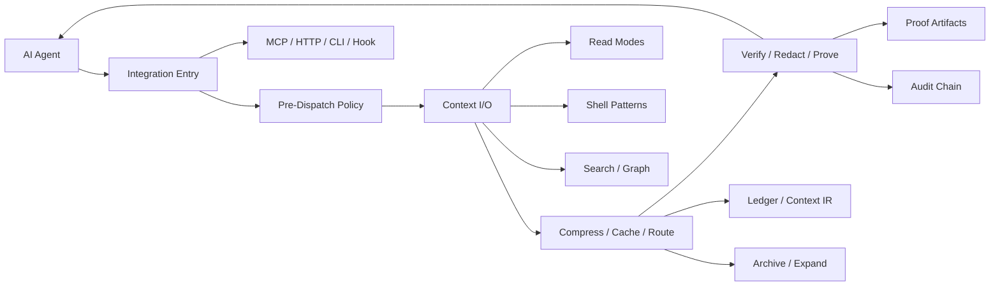

# Lean-ctx Protocol And Architecture Deep Dive

Internal note. Do not link this document from the public README unless the
competitive strategy becomes intentionally public.

Research date: 2026-05-19
Upstream repository: https://github.com/yvgude/lean-ctx
Observed upstream revision: `b4e6107aeaf9299c37d841c39bfcc84c0cfefa7e`

## Why This Needs A Separate Note

lean-ctx is materially more mature than the smaller token-compression projects
we have reviewed. It is not just a shell-output compressor. It is trying to be a
complete "context runtime" between AI agents and a codebase, with protocols,
governance, proofs, memory, context transport, and agent coordination.

For UTK, the right lesson is not "copy the product surface." lean-ctx's public
CLI, broad MCP server, VS Code package, dashboards, global setup, and team
server all conflict with UTK's hook-first constraint. The right lesson is that
their strongest capabilities are organized as contracts:

- behavioral protocols: CEP, CCP, TDD/CRP, CLP, A2A;
- data contracts: Context IR, session bundles, handoff bundles, graph
  reproducibility, knowledge policy;
- runtime contracts: path boundaries, budgets, degradation, audit, security;
- evidence contracts: proofs, ledgers, checksums, recovery IDs, bounded exports.

UTK can adopt that level of rigor while keeping a narrower Copilot hook and
artifact pipeline.

## Current Source Snapshot

Live docs reviewed:

- https://leanctx.com/docs/concepts/protocols/#cep
- https://leanctx.com/docs/cep/
- https://leanctx.com/docs/tdd/
- https://leanctx.com/docs/concepts/caching/
- https://leanctx.com/docs/concepts/multi-agent/
- https://leanctx.com/context-os/
- https://leanctx.com/docs/security/

Repository source reviewed from temporary clone:

- `ARCHITECTURE.md`
- `LEANCTX_FEATURE_CATALOG.md`
- `docs/contracts/*.md`
- `rust/src/core/context_ir.rs`
- `rust/src/core/context_field.rs`
- `rust/src/core/context_compiler.rs`
- `rust/src/core/context_ledger.rs`
- `rust/src/core/context_overlay.rs`
- `rust/src/core/context_os/context_bus.rs`
- `rust/src/core/context_proof.rs`
- `rust/src/core/session/persistence.rs`
- `rust/src/core/archive.rs`
- `rust/src/server/context_gate.rs`
- `rust/src/hooks/agents/copilot.rs`
- `rust/src/hook_handlers.rs`
- `rust/src/rewrite_registry.rs`
- `rust/src/shell/compress/engine.rs`
- `rust/src/core/patterns/mod.rs`

Important observed drift:

- The live docs currently advertise 58 or 59 MCP tools depending on page.
- The cloned `LEANCTX_FEATURE_CATALOG.md` lists 51 granular tools and 5 unified
  tools.
- The cloned README claims 59 MCP tools. Treat exact tool count as release
  metadata, not a stable architectural fact.

## Architecture Model

At a high level, lean-ctx is built as a context operating layer:



The public product has many surfaces:

- MCP stdio server;
- HTTP MCP server;
- public CLI;
- shell hook;
- Copilot and editor hook writers;
- background daemon;
- dashboard and TUI;
- TypeScript SDK;
- team server;
- context package transport.

UTK should only learn from the internal pattern: one shared mediation core with
thin entrypoints. For UTK those entrypoints should remain Copilot hooks,
repo-local skills, plugin bundle files, and internal runners.

## Protocol Map

lean-ctx's docs describe five protocols. They serve different layers of the
runtime:

| Protocol | Layer | Activation | Main purpose | UTK relevance |
|---|---|---|---|---|
| CEP | Agent behavior | Always injected into session instructions | Make model actions terse, structured, action-first, and quality-aware | Useful for UTK skill/agent style, but should not replace deterministic serialization. |
| CCP | Session recovery | Automatic interval, threshold, or manual checkpoint | Preserve cache, task, file references, facts, and stats across context loss | Very relevant to `.utk/` session artifacts and recovery summaries. |
| TDD/CRP | Token-dense output | Config/env/session setting | Use compact dialect, symbol maps, abbreviated types, and diff-only output | Relevant to serializer/provider design and session-skill compression. |
| CLP | Context preload | Session start, explicit `ctx_preload`, or auto-preload | Load task-relevant files in layered modes | Relevant as a future UTK init/preload skill, not core hook mediation. |
| A2A | Multi-agent coordination | Multi-agent sessions | Registry, bus, delegation, shared cache, handoff, diaries | Relevant to UTK session-agents/session-skills, but should stay project-local. |

## CEP: Context Engineering / Cognitive Efficiency

The protocol docs use CEP in two ways:

- "Context Engineering Protocol" in the newer protocol page, with five
  communication rules.
- "Cognitive Efficiency Protocol" in the older dedicated CEP page, with scoring,
  adaptive guidance, quality measurement, and auto-validation.

Taken together, CEP is a behavior and quality protocol for the model-facing
layer.

### Documented Behavior Rules

The newer protocol page describes five baseline rules:

- act before explaining;
- use deltas and file IDs instead of repeating paths/content;
- use structured add/remove/modify notation;
- keep each action/result short and scan-friendly;
- preserve quality, edge cases, real data, and non-placeholder behavior.

### Documented Metrics

The dedicated CEP page describes a compliance score using:

- cache utilization;
- mode diversity;
- compression rate;
- action-first communication.

It also describes adaptive complexity classification:

- mechanical work gets minimal reasoning guidance;
- standard implementation gets balanced guidance;
- architectural work gets deeper edge-case analysis.

The same page describes compression quality scoring using:

- AST preservation;
- identifier preservation;
- meaningful line preservation.

### UTK Takeaway

CEP is not just "be terse." Its more important insight is measurable behavior.
UTK should convert this into eval contracts:

- actionability score for compact hook responses;
- fact retention score for required fields;
- route confidence and fallback reason;
- no raw leakage;
- recovery artifact availability;
- explicit expansion instructions only when needed.

## CCP: Context Checkpoint Protocol

CCP is lean-ctx's answer to context-window loss. It periodically summarizes
session state and makes it recoverable after model/provider compaction.

### What CCP Captures

The docs and contracts describe checkpoint content as:

- file cache state;
- file references such as `F1`, `F2`;
- content hashes and read modes;
- task and workflow state;
- knowledge entries and diary/finding records;
- file signatures;
- token accounting and budget status;
- evidence receipts and policy hashes in bundle exports.

The `CCP Session Bundle v1` contract makes this more explicit. It requires:

- deterministic exports except timestamps;
- bounded payload size/counts;
- redaction by default;
- project identity hashes;
- role/profile policy hashes;
- session excerpts with tasks, findings, decisions, files, progress, next steps,
  evidence, and stats.

### Activation And Recovery

The protocol docs describe CCP activation at intervals, manual calls, context
pressure thresholds, and session saves. Multi-agent docs add compaction survival:

- save current state before compaction when possible;
- create a compact resume block;
- detect compaction heuristically when tool-call counters drift;
- inject resume state after a detected mismatch.

### Source Evidence

Relevant source:

- `rust/src/core/session/persistence.rs` writes JSON sessions and latest
  pointers.
- `rust/src/core/ccp_session_bundle.rs` is referenced by the contract as the
  bundle runtime.
- `rust/src/core/context_proof.rs` exports proof summaries with session,
  ledger, budgets, SLO, pipeline, verification, and evidence receipts.

### UTK Takeaway

UTK should implement a smaller but stricter checkpoint:

- `.utk/session/checkpoints/*.json`;
- raw artifact IDs and paths;
- serializer/provider IDs;
- schema IDs and route IDs;
- required fact summaries;
- current tool registry/template digest;
- route confidence and fallback reason;
- redaction/protection policy hash;
- compact resume text under a fixed token budget.

CCP's central lesson is that compression is incomplete without recovery.

## TDD / CRP: Token-Dense Dialect

TDD/CRP is lean-ctx's maximum-density output style. It combines shorthand
symbols, identifier maps, compact types, and instructions for terse model output.

### Core Mechanics

The docs describe three levels:

- signature notation using symbolic markers for functions, classes/modules,
  interfaces/traits, type aliases, enums, constants, public/private, async, and
  self/this;
- compact types such as string, number, boolean, void/unit, array/vector,
  option/maybe, and result;
- `§MAP`-style identifier maps for long names.

The newer protocol page adds that TDD should not leak into shell output. Shell
compression is separated from map/signature output so command results remain
structurally safe.

### Source Evidence

Relevant source:

- `rust/src/core/terse/*` implements terse compression components.
- `rust/src/core/signatures_ts/*` and tree-sitter handlers support structural
  signature extraction.
- `rust/src/tools/ctx_read.rs` controls read-mode output and compact hints.
- `rust/src/shell/compress/engine.rs` explicitly uses a different shell
  compression path.

### UTK Takeaway

TDD maps closely to UTK's serializer-provider work, but UTK should keep it
schema-backed:

- symbol maps should be explicit artifacts, not only prompt instructions;
- compact field names should be generated from schema history;
- official TOON and compressed JSON should stay round-trippable;
- shell outputs should not use code-signature symbols unless the output itself
  is a code summary;
- llguidance templates should enforce command parameter structure and prevent
  free-form "dense dialect" from corrupting executable semantics.

## CLP: Context Layered Preload

CLP is lean-ctx's task-start context loader. It selects relevant files and uses
different read modes by layer.

### Documented Layers

The protocol docs describe:

- L1 entry files in full mode because they are likely edit targets;
- L2 dependency/context files in map or signatures mode;
- L3 reference/transitive files as lightweight references.

The broader Context OS docs describe this as part of context prioritization:

- relevance score;
- importance and graph centrality;
- recency and access frequency;
- token cost;
- redundancy penalty.

### Source Evidence

Relevant source:

- `rust/src/core/context_field.rs` defines a potential function for context
  item value.
- `rust/src/core/context_compiler.rs` selects context under token budgets.
- `rust/src/server/context_gate.rs` uses intent, graph, knowledge, pressure,
  and budget signals to override/downgrade read modes.

### UTK Takeaway

UTK's `utk-init` skill and generated session-skills can use a CLP-like model:

- discover registered tools and output schemas;
- classify likely recurring tool families;
- preload only templates and schemas that match the current task;
- keep raw context out of the model until a tool call requires it;
- emit a compact manifest of available schema/template handles.

This should happen as skill initialization and session artifact setup, not as a
general file-reading MCP server.

## A2A: Agent-To-Agent Protocol

A2A is lean-ctx's multi-agent coordination protocol. It covers local and remote
coordination, handoffs, task delegation, and event routing.

### Local Primitives

The docs describe:

- agent registry with agent type and role;
- message bus with categories and direct messages;
- selective routing through topic filters;
- task assignment and status tracking;
- shared cache;
- persistent diaries;
- context handoff.

### Event And Bus Model

The `context_bus.rs` source models events with:

- workspace ID;
- channel ID;
- event kind;
- actor;
- timestamp and version;
- optional parent;
- consistency level;
- payload;
- optional target agents.

Event consistency is categorized as:

- local;
- eventual;
- strong.

Topic filters can match kinds, actors, minimum consistency, and agent identity.
The bus uses SQLite with WAL, a write connection, read pool, and broadcast
streams. The docs also describe REST and SSE remote-agent endpoints.

### Transport And Handoffs

The `A2A Contract v1` and handoff contract describe:

- bounded exports;
- deterministic ordering;
- privacy-aware visibility;
- private messages requiring explicit recipients;
- task state machines;
- token-bucket rate limiting;
- HMAC-SHA256 transport envelopes;
- Google A2A-compatible JSON-RPC endpoints for tasks;
- Ed25519 signed handoff bundles in the docs.

There is some terminology overlap between HMAC transport and Ed25519 handoff
signatures. For UTK planning, the principle matters more than the exact signing
scheme: handoffs need integrity, project identity, bounds, and redaction.

### UTK Takeaway

UTK's session-agents and session-skills can learn from A2A without copying a
server:

- each generated session-agent should have an identity, role, scope, and policy;
- each generated session-skill should have a purpose, trigger conditions, and
  compact schema/template handles;
- messages/findings should be project-local `.utk/` artifacts;
- handoff bundles should include raw artifact references and schema versions;
- any cross-agent transfer should be bounded, redacted, and auditable.

## Context IR

Context IR is lean-ctx's stable intermediate representation for context events.
The contract describes it as an observability artifact for read/search/shell and
provider outputs.

### Fields

Source code shows each item records:

- sequence number;
- timestamp;
- source kind;
- tool name;
- optional client and agent IDs;
- optional path, command, pattern;
- input and output token counts;
- duration;
- compression ratio;
- bounded content excerpt;
- truncation flag;
- safety metadata;
- content checksum.

### Bounds

The source enforces:

- 128 max items;
- 4096 chars max excerpt per item;
- 65536 total excerpt chars.

Older items are pruned first. Stored text is redacted before persistence.

### UTK Takeaway

UTK needs a similar `.utk/context-ir.jsonl` or `.utk/context-ir/*.json`:

- every mediated tool call should get a stable record;
- raw payloads should live separately and be referenced by hash/path;
- compact response should be tied to serializer ID, schema ID, and route ID;
- content excerpts must be bounded and redacted;
- token metrics and confidence should be stored with the event.

This would unify RTK metrics, Copilot hook mediation, serializer validation, and
artifact recovery.

## Context Ledger, Field, Compiler, And Overlays

lean-ctx's Context Field Theory modules are the most interesting architectural
piece beyond the protocols.

### Context Field

`context_field.rs` combines signals into a scalar potential:

- task relevance;
- surprise/information;
- graph proximity;
- history;
- token cost;
- redundancy.

It also defines context item IDs, context kinds, states, view kinds, and view
costs. View kinds include full, signatures, map, diff, aggressive, entropy,
lines, reference, and handle.

### Context Ledger

`context_ledger.rs` records which context was sent:

- path;
- mode;
- original tokens;
- sent tokens;
- timestamp;
- item ID;
- kind;
- source hash;
- state;
- potential score;
- view costs;
- active view;
- provenance.

It also computes context pressure and recommended actions.

### Context Compiler

`context_compiler.rs` turns candidates into a minimal context package under a
token budget. The source comments describe the pipeline:

- load ledger and overlays;
- score candidates;
- select with greedy knapsack;
- dedupe redundant items;
- order for attention;
- render;
- record provenance.

### Context Overlays

`context_overlay.rs` models reversible context mutations:

- include;
- exclude;
- pin or unpin;
- rewrite;
- set view;
- set priority;
- mark outdated;
- expire.

Overlays can be scoped to a call, session, project, agent, or global state.

### UTK Takeaway

For UTK this becomes a design pattern for session artifacts:

- a tool call is a context item;
- serializers are view kinds;
- schemas/routes are provenance;
- protected fields are pinned;
- redaction and leakage rules are overlays/policies;
- route confidence plus token savings is a utility score;
- fallback to raw artifact reference is a pressure action.

UTK does not need the full field theory, but it does need a coherent scoring and
policy model so optimizations remain explainable.

## Caching, Archives, And Recovery

lean-ctx has several recovery layers:

- session cache for repeated file reads;
- file references like `F1`;
- predictive delta reads;
- archive IDs for large tool outputs;
- tee files for failed commands;
- context compaction checkpoints;
- handoff/session bundles.

The caching docs emphasize a "cache-safe" invariant:

- no silent overwrite of cache references;
- hash validation on cache hit;
- immutable archive entries;
- no partial reads entering cache;
- doctor checks for consistency.

Source `archive.rs` stores archive content by hash, writes metadata, indexes
full text, and provides retrieval by full content, line range, and search.

### UTK Takeaway

This is one of the highest-value areas to copy conceptually:

- raw artifacts should be immutable by content hash;
- compact responses should include recovery IDs;
- range and search recovery should be available for large outputs;
- failed shell commands should persist full stderr/stdout;
- raw/compact/schema artifacts should be checked by a doctor/test command or
  skill workflow;
- artifact IDs should be stable enough for follow-up messages.

## Security And Governance

lean-ctx treats context manipulation as a security boundary.

### Documented Controls

The security docs describe:

- local-first processing and telemetry off by default;
- PathJail on path-like arguments;
- symlink and TOCTOU protection;
- team-server token scopes;
- SHA-256 chained audit logs;
- redaction policies;
- secret scanning before delivery;
- OWASP Agentic Top 10 mapping;
- capability-based tool dispatch;
- OS sandboxing on supported platforms;
- shell allowlist mode;
- HTTP proxy token and host-header hardening;
- signed handoff bundles;
- per-agent ledgers;
- token budgets;
- declarative policy engine;
- compliance reports;
- auto-reroot protection;
- atomic writes.

### Source Evidence

The cloned source includes corresponding modules:

- `pathjail.rs`;
- `redaction.rs`;
- `secret_detection.rs`;
- `roles.rs`;
- `sandbox.rs`, `sandbox_landlock.rs`, `sandbox_seatbelt.rs`;
- `shell_allowlist.rs`;
- `audit_trail.rs`;
- `degradation_policy.rs`;
- `config_io.rs` atomic writes.

### UTK Takeaway

UTK's smaller security contract should still be explicit:

- path-like fields are protected and never detok-rewritten;
- command strings are not rewritten unless template parsing proves safety;
- secrets are redacted in compact metadata and persisted only according to
  policy;
- raw artifacts are project-local under `.utk/`;
- artifact writes are atomic;
- policies have hashes recorded in Context IR;
- no hook should block execution on internal failure unless a policy explicitly
  demands blocking.

## Intent Routing And Degradation

lean-ctx's `Intent Route v1` and `Degradation Policy v1` contracts are useful
because they make routing decisions observable.

### Intent Route

The contract maps:

- task type and confidence;
- budget status;
- context pressure;

into:

- model tier recommendation;
- read-mode recommendation;
- reason string.

It stores a hash and redacted excerpt rather than raw query text.

### Degradation Policy

The degradation contract defines a deterministic ladder:

- warn;
- throttle;
- block.

The default is recommendation-first. Blocking requires explicit role policy.

### UTK Takeaway

UTK route summaries should include:

- deterministic route ID;
- route confidence;
- serializer selected;
- fallback status;
- budget/pressure signal;
- explicit reason code;
- raw query/input hash, not raw sensitive text.

This would make schema routing and constrained decoding much easier to debug.

## Proofs And Verification

lean-ctx's proof system turns context manipulation into auditable artifacts.
`context_proof.rs` collects:

- schema version;
- creation time and lean-ctx version;
- session ID;
- project identity hashes;
- role and profile policy hashes;
- budget snapshot;
- SLO snapshot;
- pipeline stats;
- verification stats;
- ledger summary;
- evidence receipts.

The graph reproducibility contract extends this to architecture/graph outputs
with deterministic ordering, freshness metadata, truncation flags, and proof
exports.

### UTK Takeaway

UTK should build proof artifacts around tool mediation:

- raw artifact hash;
- compact artifact hash;
- schema ID and serializer ID;
- route confidence;
- required facts retained;
- recovery path exists;
- no raw leakage;
- token savings versus raw and RTK baseline;
- policy hash;
- guidance/llguidance availability status.

This is the right architecture for "comparable quality to RTK" claims.

## Comparison To UTK's Current Direction

| lean-ctx concept | Adopt for UTK | Avoid for UTK |
|---|---|---|
| Public CLI | Internal hook runner only | Public `utk` CLI surface |
| MCP server | Maybe internal/local optional detok only because user requested it | Broad MCP tool suite |
| Shell patterns | Yes, as eval fixtures and template/schema registry | Shell-only product center |
| Copilot hooks | Yes | Global surprise installs |
| Context IR | Yes, project-local `.utk` version | Global-only store |
| Archive/expand | Yes | Truncation without recovery |
| CEP | Yes as eval contract and skill guidance | Persona/style-only compression |
| CCP | Yes as `.utk` checkpoints | Model-only summaries as source of truth |
| TDD/CRP | Yes as schema-backed compact notation | Unvalidated symbol dialect in shell output |
| CLP | Yes through `utk-init` and session skills | General file-reading platform |
| A2A | Yes as project-local generated agents/skills | Remote/team-server scope |
| Policy/security | Yes, lean subset | Overbroad enterprise platform |
| Proofs | Yes for eval-backed claims | Vanity token savings reports |

## Recommended UTK Architecture Inspired By Lean-ctx

### 1. UTK Context IR

Add a versioned project-local record:

```text
.utk/context-ir/events.jsonl
.utk/context-ir/latest.json
```

Each mediated event should include:

- schema version;
- tool ID;
- input hash;
- raw output artifact hash/path;
- compact artifact hash/path;
- serializer ID;
- schema ID;
- route ID;
- route confidence;
- token counts;
- required fact summary;
- redaction/protection flags;
- guidance availability;
- timestamp;
- policy hash.

### 2. UTK Checkpoints

Add:

```text
.utk/checkpoints/<session-id>/<checkpoint-id>.json
.utk/checkpoints/<session-id>/resume.md
```

Checkpoint content:

- active serializers;
- tool schemas/templates;
- recent routes;
- repeated tasks detected for generated skills/agents;
- artifact index summary;
- stats and failing/low-confidence routes;
- concise resume block.

### 3. UTK Artifact Archive

Strengthen:

```text
.utk/artifacts/raw/
.utk/artifacts/compact/
.utk/artifacts/index.json
.utk/artifacts/search.sqlite
```

Capabilities:

- retrieve by artifact ID;
- retrieve line ranges for text;
- search all raw artifacts;
- validate compact artifact against schema;
- regenerate compact artifact with another serializer.

### 4. UTK Route Contract

Define a route record:

```ts
type UtkRouteRecordV1 = {
  schemaVersion: 1;
  toolId: string;
  inputHash: string;
  rawArtifactId: string;
  schemaId: string;
  routeId: string;
  confidence: number;
  serializerId: "toon" | "compressed-json";
  deterministic: boolean;
  constrainedFallback: "not-needed" | "used" | "unavailable" | "failed";
  reasonCode: string;
};
```

This connects current UTK routing, guidance fallback, and metrics work.

### 5. UTK Protocol Vocabulary

UTK can define its own narrower protocols:

- TMP: Tool Mediation Protocol for capture, route, serialize, persist.
- TRP: Tool Recovery Protocol for artifact expansion and regeneration.
- TSP: Tool Schema Protocol for schema history and llguidance templates.
- TEP: Tool Evaluation Protocol for RTK parity metrics and fact retention.
- TGP: Tool Generation Protocol for session-skills/session-agents.

These names are optional, but the boundaries are important. lean-ctx's maturity
comes from named contracts with tests, not just features.

## Research Questions To Revisit

Current benchmark follow-up: `docs/internal/leanctx-copilot-benchmark-results.md`
now tracks Copilot-specific LeanCTX comparisons, and
`docs/internal/benchmark-summary.md` aggregates all benchmark families.

1. How much of lean-ctx's shell pattern behavior is actually better than RTK on
   UTK's current parity fixtures?
2. Which lean-ctx command families should become UTK llguidance command
   templates first?
3. Can UTK generate route schemas from Copilot tool payloads as cheaply as
   lean-ctx exposes MCP tool schemas?
4. What is the smallest `.utk` Context IR that unlocks metrics, recovery, and
   generated session skills without building a whole Context OS?
5. Should UTK's detok/LLMLingua work be represented as a separate protocol in
   Context IR, or as a serializer/preprocessor field?
6. How should UTK verify compact responses against raw artifacts when outputs
   are binary, streaming, or tool-specific objects?
7. Should UTK introduce proof artifacts before or after the route/schema
   pipeline stabilizes?

## Bottom Line

lean-ctx's main advantage is not only compression quality. Its advantage is that
it treats context as a governed runtime object with identity, policy, bounded
representations, recovery, and evidence.

UTK should stay narrower:

- Copilot hook first;
- no public CLI;
- no broad MCP server;
- project-local `.utk/` artifacts;
- schema/route/serializer core;
- metrics and proof artifacts for RTK parity.

But UTK should borrow the deeper architectural discipline: every optimization
needs an ID, a policy, a bounded representation, a recovery path, and a metric
that can fail CI.
