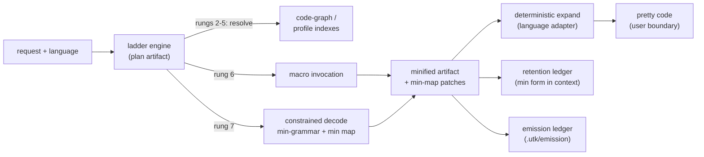

# Ponytail Features Plan: Grammar-Grounded Emission (GGE)

Internal note. Do not link this document from the public README unless the
competitive strategy becomes intentionally public.

Plan date: 2026-07-02
Status: proposed (pre-implementation)
Related: [Ponytail research](/competition/ponytail/research.md),
[gap matrix](/techniques/context-gateway-proxy/gap-matrix.md),
[evals-driven iteration](/features/evals/evals-driven-iteration.md)

## Problem Statement

UTK today mediates the **tool-output** axis: raw payloads are persisted,
compacted, and referenced. Detok compresses natural-language spans. Caveman
modes compress assistant prose. The one axis UTK does not yet mediate is
**code authoring** — the tokens an agent spends *writing code*. That axis is
exactly where Ponytail (~71.5k stars) competes, but Ponytail attacks it with
informal prompt pressure ("lazy senior dev" ruleset). This plan formalizes the
same learnings as deterministic, artifact-backed, eval-gated machinery, and
adds a second lever Ponytail does not have: **generation-side token
minification** with deterministic recovery to readable code.

Two ideas are integrated:

1. **Ponytail's decision ladder, formalized.** Each rung of the
   YAGNI → reuse → stdlib → platform → dependency → one-liner → MVP ladder
   becomes a machine-checkable pipeline stage with evidence, an artifact, and
   an eval gate — instead of prompt-injected behavioral pressure.
2. **Minified emission with min maps.** Code is *generated* in a compact,
   grammar-constrained surface form whose identifiers are single-token symbols
   defined in a **min map** (the source-map analogy from minified TypeScript).
   Deterministic converters expand the minified form into the "pretty" form.
   Users only ever see pretty code.

The combined effect is multiplicative: the ladder cuts what gets written; the
min-grammar cuts the tokens spent writing what remains; retention of the
minified form (not the pretty form) in context history cuts input tokens on
every subsequent turn.

## Analysis Of The Proposed Design

The proposal (grammar grounding → compact grammar → min map → patch-based map
updates → deterministic min↔pretty conversion → pretty-only user output →
llguidance-constrained decoding → macro/DSL layer) is a strong fit for UTK's
existing discipline. Assessment of each element against the codebase, with
corrections where the proposal needs grounding adjustments:

### What fits as-is

- **`.lark` grounding.** UTK is already `.lark`-only: pack grammars persist at
  `.utk/tools/<normalized-tool-id>/fields/<normalized-field>.lark`
  (`packages/core/src/pack/installPackArtifacts.ts`), lint enforces a `start:`
  rule and rejects `.grammar.json`
  (`packages/core/src/pack/lintPackGrammars.ts`), and serializer grammars are
  normalized with `llguidancePrefix: '%llguidance {}'` plus a content hash
  (`packages/core/src/serialization/serializationPluginManifest.ts`).
- **Constrained decoding seam.** `@utk/constrained-decoder` exposes
  `completeWithGrammar({prompt, lark, slotName, ...})`, which is the exact
  `GrammarCompletion` callback shape `renderTemplate` consumes
  (`packages/core/src/templates/templateRuntime.ts`). It honestly reports
  `available: false` when no guidance session is configured and callers fall
  back to deterministic completion — this contract must carry over unchanged.
- **Round-trip discipline.** The serialization layer already implements
  canonical-drift detection (`serialization/canonical-drift` in
  `packages/core/src/serialization/grammarCodec.ts`): serialize → parse →
  compare. The min↔pretty converters get the identical treatment.
- **Reuse detection.** `@utk/code-graph` already provides `findSymbol`,
  `findReferences`, `renameSymbol`, `retrieveContext`, alias collection, and
  content-hashed symbol ids (`cg_<sha256[16]>`) over the TypeScript compiler
  API. This is the machinery both for ladder rung 2 (reuse) and for sourcing
  min-map entries from existing codebase symbols.
- **Deterministic-first, constrained-fallback.** Schema routing already runs
  deterministic routing first (`deterministic_confidence_threshold = 0.95`)
  with constrained routing as fallback. The ladder engine reuses this exact
  architecture.

### Corrections the proposal needs

1. **No local Lark parser exists.** `.lark` grammars in this repo are consumed
   by `guidance-ts` via the injected `runtime.buildGrammar`; nothing parses
   Lark locally. Building a general Lark engine to power min↔pretty conversion
   would be a large, risky dependency. Correction: **grammars ground
   generation; language adapters ground conversion.** The min-grammar
   constrains what the model can emit (llguidance side). The deterministic
   min↔pretty transform is implemented per language by a language adapter —
   for TypeScript, the TS compiler API already used by `@utk/code-graph`. This
   keeps both halves deterministic without a new parser stack.
2. **"Single token" is tokenizer-dependent.** A symbol that is one token in
   one BPE vocabulary may be two in another; the evals token estimate is
   `ceil(len/4)` (`packages/evals/assertions/tokenBudgets.ts`), which cannot
   verify single-token claims. Correction: min-map ids are allocated from a
   **committed, versioned single-token pool** (a data file of ids verified
   offline against target vocabularies), with a pluggable `TokenCounter`
   adapter. Savings are *measured* in evals, never assumed from id length.
3. **"Generate a grammar per language" is unbounded.** Authoring a
   full-language Lark grammar on the fly is YAGNI-violating by Ponytail's own
   rung 1. Correction: ship versioned **emission profiles** — grammar subsets
   covering the constructs UTK actually emits — as packs, starting with one
   language (TypeScript). The compact variant is *derived* from the base
   grammar by a deterministic transform and staleness-gated (the same
   byte-equality discipline the evals use for generated `.EVAL.yaml` files).
4. **Min-map patches must be part of the grammar.** If the model can only emit
   ids the grammar knows, it can never introduce a new symbol. Correction: the
   min-grammar embeds a `patch` production so a new symbol is introducible
   **only** by first emitting a compact min-map patch that binds a fresh id to
   a pretty name — "declare-before-use" enforced grammatically. This is the
   formalization of resolve-before-emit: every identifier in emitted code
   either resolves in the min map or is grammatically preceded by its own
   declaration patch.
5. **"Pretty to the user" needs an enforcement point, not a convention.** The
   natural boundary is the model proxy response pipeline (and, for hosts
   without the proxy, the Copilot hook surface). Expansion happens there,
   test-gated; minified text never reaching a user-facing surface is an eval
   gate, not a style rule.

## How Ponytail Does Its Job (What We Keep, What We Replace)

From [ponytail-competitive-research.md](/competition/ponytail/research.md):
Ponytail injects a behavioral ruleset; before emitting code the agent climbs a
seven-rung ladder (YAGNI → reuse → stdlib → platform → dependency → one-liner
→ MVP), tuned by `lite`/`full`/`ultra`/`off` intensity modes, with safety
carve-outs (trust boundaries, data loss, security, accessibility exempt from
cutting), a deferred-shortcut ledger (`ponytail:` markers harvested by
`/ponytail-debt`), and a benchmark that gates savings on safety. Its own
control arm shows that removing the carve-outs regresses correctness (100% →
95% safety), and its own agentic numbers show a 54% code cut yields only ~22%
token savings.

| Ponytail mechanism | Keep the learning | Replace the mechanism with |
|---|---|---|
| Decision ladder (prompt text) | Yes — the rung order is right | Deterministic predicates per rung, evidence-backed plan artifact, constrained fallback |
| Intensity modes | Yes — mirrors caveman `lite`/`full`/`ultra` machinery | `[emission] mode` policy in `.utk/config.toml`; every mode preserves recoverability |
| Safety carve-outs | Yes — the control-arm lesson is the core lesson | First-class non-minifiable classes in policy; `ultra` cannot disable them (test-gated) |
| Deferred-shortcut ledger | Yes | Append-only emission ledger under `.utk/`; every macro expansion, min-map patch, and ladder decision is enumerable and recoverable |
| Savings-with-safety benchmark | Yes | `ponytailParity` eval suite; token wins do not count unless every quality gate is 1.0 |
| Prompt-injected ruleset as the delivery vehicle | No | Skills carry *guidance*; mediation stays deterministic (per the gap-matrix non-goals) |
| Multi-host sprawl, public CLI, core MCP server | No | UTK stays hook-first and Copilot-first |

## Integrated Design

### The ladder, formalized

`planEmission({workspaceRoot, request, language})` produces an
`EmissionPlan` artifact (`.utk/emission/plans/<run>/plan.json`) recording, per
requested capability, the first rung whose predicate holds and the evidence:

| Rung | Ponytail phrasing | GGE predicate (deterministic evidence) |
|---|---|---|
| 1 | Does this need to exist? | Plan gate: request maps to an existing satisfier or an explicit no-op; refuses emission when rungs 2–5 fully satisfy the request |
| 2 | Already in this codebase? | `@utk/code-graph` `findSymbol`/`retrieveContext` hit; resolved symbols enter the min map as `source: cg_<hash>` entries |
| 3 | Stdlib does it? | Language profile stdlib index lookup (data shipped in the language pack) |
| 4 | Native platform feature? | Language profile platform-capability index lookup |
| 5 | Installed dependency? | Manifest scan (`package.json`, lockfiles) feeding the resolver |
| 6 | One line? | Macro invocation: a single min-grammar production expanding to a known idiom |
| 7 | Minimum viable implementation | Constrained decode against the min-grammar, minified emission |

Rungs 1–5 are deterministic where the evidence is unambiguous; ambiguous cases
fall back to a constrained route over rungs using the same
`buildRouteGrammar`-style grammar the schema router uses — mirroring the
existing deterministic-first/constrained-fallback split.

### The emission pipeline



- **Generation** is constrained by the compact grammar
  (`grammar.min.lark`), whose identifier terminals are the min-map id pool
  plus the grammatical `patch` production for new symbols. Macros appear as
  additional productions. Emission uses the existing
  `renderTemplate`/`completeWithGrammar` seam; when no guidance runtime is
  available it reports `available: false` and falls back to deterministic
  macro/template completion — never fakes success.
- **Expansion** is the language adapter applying the min map (parse with the
  native toolchain, rename, print canonically). Round-trip laws:
  `expand(minify(pretty)) == canonicalize(pretty)` and
  `minify(expand(min)) == min`. Drift is a lint failure, exactly like
  `serialization/canonical-drift`.
- **The user boundary always expands.** The model proxy response pipeline
  detects minified emission blocks (fenced ` ```utk-min:<lang> `), expands
  them, and forwards pretty code to the client. Retention keeps the minified
  form so subsequent-turn context is cheap. Raw and expanded artifacts persist
  under `.utk/` with the usual recovery references.

### Min map and patch format

- **Min map**: versioned, canonical, content-hashed JSON per
  language/workspace at `.utk/lang/<lang>/minmap.json`. Entries:
  `minId ↔ prettyName`, kind (`ident` | `macro` | `keyword`), scope, and
  provenance (`cg_<hash>` codebase symbol, `stdlib`, or `new`).
- **Patches**: compact line-oriented ops (`+ <id> <pretty>`, `- <id>`,
  `~ <id> <pretty>`) with their own tiny `.lark` grammar, so patch emission is
  itself constrained. Patches are `apply`/`invert`-able and journaled
  append-only to `.utk/lang/<lang>/minmap.journal.jsonl`; replaying the
  journal reproduces the map (crash-safe via the existing `atomicWriteFile`
  pattern).
- **Allocation**: deterministic allocator over the committed single-token
  pool; codebase symbols get stable ids keyed by their `cg_` hash so maps are
  reproducible across runs.

### Macro / DSL layer

Macros formalize rung 6 and extend the existing prompt-template DSL
(`defineTemplate`) rather than inventing a new engine:

- `defineMacro({name, minToken, params, expansion})` — params carry
  `GrammarRef`s exactly like template slots; `expansion` is a pretty-source
  template with `{{param}}` slots.
- The macro compiler folds macro signatures into `grammar.min.lark` as
  productions (`macro_call: MACRO_ID "(" args ")"`), so one emitted token plus
  arguments replaces an idiom's full body.
- Expansion is deterministic via `renderTemplate` with prefilled inputs; every
  expansion writes an emission-ledger entry (macro id, arguments, expanded
  span) so `ultra`-mode aggressiveness stays reviewable — the `/ponytail-debt`
  analog reviews this ledger.
- Macros ship in packs alongside grammars and profiles, are linted by
  `lintPack` extensions, and are workspace-extendable.

### Policy, modes, and safety carve-outs

`.utk/config.toml` gains an `[emission]` table:

```toml
[emission]
mode = "full"            # lite | full | ultra | off
languages = ["typescript"]

[emission.safety]
# classes never minified, macro-compressed, or dropped:
carve_outs = ["security", "trust-boundary", "data-loss", "diagnostics", "user-facing-strings"]
```

- `lite` = ladder guidance only; `full` = ladder + macros; `ultra` = ladder +
  macros + minified emission with retention of min form. `off` disables GGE.
- Carve-outs are structural, not advisory: spans classified into a carve-out
  class bypass minification and macro compression entirely, and no mode can
  disable a carve-out (a dedicated test asserts `ultra` keeps them — encoding
  Ponytail's control-arm lesson as a permanent regression gate).
- Pretty-only user output is itself a carve-out enforced at the proxy
  boundary.

## Package And Artifact Layout

New workspace package `packages/emission` (`@utk/codegen`), following the
`@utk/code-graph` precedent (own `src`/`test`, root `vitest.config.ts` alias).
Dependencies: `@utk/core` (templates, config, artifacts, pack surface),
`@utk/code-graph` (reuse resolution, TS adapter), `@utk/constrained-decoder`
(grammar completion). `@utk/model-proxy` gains an expansion stage; core gains
pack-manifest `[[languages]]` support.

```text
packages/emission/
├── src/minmap/{format,allocator,patch,journal}.ts
├── src/languages/{adapter.ts,typescript.ts}
├── src/grammars/deriveMinGrammar.ts
├── src/macros/{defineMacro,compileMacros,expandMacro,ledger}.ts
├── src/ladder/{predicates,planEmission,policy}.ts
├── src/emit/{emitConstrained,expandBoundary}.ts
├── grammars/typescript.emit.lark          # committed base profile
├── grammars/typescript.emit.min.lark      # generated, staleness-gated
├── data/single-token-pool.json            # committed verified id pool
└── test/...
```

Workspace artifacts:

```text
.utk/lang/<lang>/{grammar.lark, grammar.min.lark, minmap.json, minmap.journal.jsonl}
.utk/lang/<lang>/macros/<name>.macro.json
.utk/emission/plans/<run>/plan.json
.utk/emission/ledger.jsonl
```

Language packs reuse the installer: a `[[languages]]` manifest section (id,
grammar, profile, macros) linted by new `lintPack` codes and persisted via the
existing atomic/rollback machinery.

## Testable TDD Implementation Plan

Ground rules for every phase (from `packages/evals/AGENTS.md` and root
config): write the failing test first; `npm run typecheck && npm run build &&
npm test && npm run coverage` green at phase exit with 100%
statements/branches/functions/lines (add the negative-branch coverage tests
the way `packages/evals/evals/coverage.test.ts` does); benchmark-affecting
changes update the competitor `parity-benchmark.md` docs and
`benchmark-summary.md` in the same change; token savings never count if a
quality gate drops below 1.0.

### Phase 1 — Min-map kernel (pure, no LLM, no I/O beyond artifacts)

- Tests first: `packages/emission/test/minmap-format.test.ts`,
  `minmap-allocator.test.ts`, `minmap-patch.test.ts`,
  `minmap-journal.test.ts`.
- Laws under test: canonical hash stability; allocator determinism (same
  inputs → same ids; `cg_` provenance keys stable); `apply(invert(p)) ≡ id`;
  journal replay reproduces the map byte-for-byte; patch text conforms to the
  patch `.lark` (validated as text against the committed grammar fixture);
  malformed patches rejected with typed errors.
- Implement: `src/minmap/*`, `data/single-token-pool.json` (with an offline
  verification script whose output is committed, mirroring the Compresr
  `verify-*-install` pattern).
- Exit: kernel is dependency-free and 100% covered.

### Phase 2 — TypeScript language adapter (deterministic min↔pretty)

- Tests first: `languages-typescript-roundtrip.test.ts` over a fixture corpus
  (`packages/emission/fixtures/ts/*.ts`) spanning functions, classes,
  imports/exports, generics, string literals, template literals, comments.
- Laws under test: `expand(minify(x)) == canonicalize(x)`;
  `minify(expand(m)) == m`; idempotence; carve-out spans (string literals,
  security-flagged regions, diagnostics text) byte-identical through both
  directions; drift raises `emission/canonical-drift`.
- Implement: `src/languages/typescript.ts` on the TS compiler API, reusing
  `@utk/code-graph` symbol/alias collection; scope of phase 2 is **identifier
  minification only** (structure and keywords unchanged) — keyword-level
  compaction is deferred to the grammar layer where llguidance enforces it.
- Exit: round-trip suite green across the corpus; adapter interface
  (`LanguageAdapter`) documented for future languages.

### Phase 3 — Emission grammars (base profile + derived min-grammar)

- Tests first: `grammar-profile.test.ts` (base grammar has `start:`, passes
  the same checks `lintPackGrammars` applies), `derive-min-grammar.test.ts`
  (derivation is deterministic; identifier terminals reference the pool +
  `patch` production; committed `typescript.emit.min.lark` byte-equals
  `deriveMinGrammar(base)` — the `.EVAL.yaml` staleness pattern),
  `declare-before-use.test.ts` (strings using an undeclared id do not parse;
  the same strings preceded by a patch block do).
- Implement: `grammars/typescript.emit.lark`,
  `src/grammars/deriveMinGrammar.ts`, `lintPack` extension codes
  (`emission/grammar/*`), `[[languages]]` manifest support in
  `packages/core/src/pack/*` with installer persistence to `.utk/lang/`.
- Exit: grammar artifacts committed, generated, and staleness-gated.

### Phase 4 — Macro engine

- Tests first: `macro-define.test.ts` (validation parity with
  `defineTemplate`), `macro-compile.test.ts` (composed min-grammar remains
  lint-clean; macro ids come from the pool), `macro-expand.test.ts`
  (expansion determinism; expansion output passes the phase-2 round-trip;
  ledger entry written per expansion; macros refused inside carve-out spans).
- Implement: `src/macros/*` on top of `renderTemplate`; starter macro set for
  TypeScript idioms shipped in the language pack.
- Exit: one emitted macro call + args expands to the full idiom
  deterministically, recorded in `.utk/emission/ledger.jsonl`.

### Phase 5 — Ladder engine and policy

- Tests first: `ladder-predicates.test.ts` against fixture workspaces —
  `reuse-exists` (code-graph must resolve; plan stops at rung 2),
  `dep-exists` (rung 5), `stdlib-covered` (rung 3), `genuinely-new`
  (rung 7); `ladder-plan-artifact.test.ts` (plan JSON canonical, evidence
  present, recoverable); `ladder-fallback.test.ts` (ambiguous fixtures route
  through the constrained rung-grammar with the honest `available:false`
  path); `emission-policy.test.ts` (mode matrix lite/full/ultra/off; **ultra
  cannot disable carve-outs**).
- Implement: `src/ladder/*`, `[emission]` config parsing in core config
  module, rung-route grammar via `@utk/constrained-decoder`.
- Exit: every emission is preceded by a plan artifact; refuses rung-7 output
  when rungs 2–5 satisfy the request.

### Phase 6 — Constrained emission integration

- Tests first: `emit-constrained.test.ts` with a DI-stubbed guidance runtime
  (the `packages/constrained-decoder/test` pattern): stub runtime produces
  min-grammar-conformant output → captured, validated, ledgered; no runtime →
  `available:false` and deterministic macro/template fallback; guidance
  sidecars (`*.guidance.json`) persisted next to emission artifacts.
- Implement: `src/emit/emitConstrained.ts` wiring `completeWithGrammar` into
  slot-level emission.
- Exit: end-to-end plan → constrained min emission → expand → pretty, fully
  offline-testable.

### Phase 7 — Model-proxy expansion boundary

- Tests first: `packages/model-proxy/test/emission-boundary.test.ts` with a
  stub upstream: response containing ` ```utk-min:typescript ` block → client
  receives pretty code only (a "no min leakage" assertion greps the client
  payload for pool ids/fences); retention keeps the min form in the session
  ledger; recovery endpoint returns both forms; malformed min blocks fail
  open (raw passthrough + failure log, matching existing fail-open classes).
- Implement: expansion stage in the proxy pipeline (after forward, before
  client write), retention integration, metrics counters.
- Exit: pretty-only user boundary is machine-enforced.

### Phase 8 — `ponytailParity` benchmark suite

Follows the established suite checklist exactly:

1. `packages/evals/fixtures/ponytailParityFixtures.ts` — three committed
   deterministic arms per scenario: verbose baseline (hand-authored
   conventional assistant output), Ponytail-style terse arm (ladder-guided,
   modeled on the published rung examples such as date-picker →
   `<input type="date">`), and the UTK GGE arm (min emission + expansion),
   plus required facts and mode variants (mirroring
   `cavemanBaselineForMode`).
2. `packages/evals/metrics/ponytailParityMetrics.ts` —
   `measurePonytailParity`/`assertPonytailParity` gating: token ratio vs both
   baselines, `roundTripFidelityScore === 1`, `parseValidityScore === 1`
   (expanded output parses with the language toolchain),
   `ladderCorrectnessScore === 1` (plan stopped at the right rung on
   reuse/stdlib/dep fixtures), `carveOutScore === 1`,
   `minLeakageScore === 1` (no pool ids in user-facing text),
   `autoevalsFactScore === 1`.
3. Grader, report, and YAML: `graders/ponytailParityCodeGrader.ts`,
   `reports/ponytailParityReport.ts` (`buildPonytailParityReport` +
   `renderPonytailParityEvalYaml`), `evals/ponytail-parity.EVAL.yaml`
   (byte-checked), `evals/ponytail-parity-metrics.test.ts`,
   `evals/ponytail-parity.eval.ts`.
4. Glue: `packages/evals/index.ts` re-exports, `bench:ponytail` /
   `report:ponytail` scripts.
5. Docs in the same change: `docs/competition/ponytail/parity-benchmark.md`,
   a row in `docs/features/evals/benchmark-summary.md`, a line in `docs/features/evals/evals.md`,
   and an updated Ponytail row in the gap matrix (from "skill guidance +
   carve-outs" to the GGE implementation and its fixtures).
- Exit: suite green with every quality gate at 1.0; report honestly records
  any scenario where a baseline beats GGE (the Ponytail honesty-note
  discipline), including the expected case that savings concentrate in
  emission-heavy scenarios.

### Phase 9 — Skills, session artifacts, and docs

- `skills/utk-emission/SKILL.md` + references: ladder-first guidance for
  hosts without the proxy, mode switching, and the emission-debt review flow
  (`/ponytail-debt` analog over `.utk/emission/ledger.jsonl` and the min-map
  journal).
- `utk-init` extension seeds `.utk/lang/` for selected languages.
- Public docs: `docs/emission.md`, README section, architecture-doc surface
  table row. Tests: skill/reference lint consistency where the repo already
  gates generated copies.

### Sequencing and trace-gated iteration

Dependency order: P1 → P2 → P3 → (P4 ∥ P5) → P6 → P7 → P8 → P9. Each phase is
independently shippable and leaves `main` green. From P6 onward, mediated
emission runs emit `.utk/events/<run>.{jaeger.json,eval_set.json}` so the
agentevals harness (`diffScorecards` against frozen
`packages/evals/baselines/*.json`, updates behind `UTK_BASELINE_UPDATE=1`)
gates prompt/grammar/macro tuning between benchmark runs.

## Success Metrics

| Metric | Target | Gate |
|---|---|---|
| Emission token ratio vs verbose baseline (`ultra`) | ≤ 0.50 | counts only with all quality gates 1.0 |
| Emission token ratio vs Ponytail-style terse arm | < 1.00 strictly | same |
| Round-trip fidelity / parse validity / carve-outs / min leakage | 1.0 | hard fail below 1.0 |
| Ladder correctness on reuse/stdlib/dep fixtures | 1.0 | hard fail |
| Expansion determinism (repeat runs byte-identical) | 1.0 | hard fail |
| Coverage | 100% all four thresholds | repo-wide gate |

## Risks And Non-Goals

- **Do not** regress into a prompt-only ruleset: skills carry guidance; the
  ladder, min map, and converters are deterministic machinery. (Gap-matrix
  non-goals hold.)
- **Do not** equate code-cut with token-cut. Ponytail's own numbers (54% code
  → ~22% tokens) are the warning; every claim here is measured on tokens by
  the parity suite.
- **Do not** require a live guidance runtime. Every constrained path keeps the
  `available:false` deterministic fallback; benchmarks run fully offline
  against committed baselines.
- **Do not** let `ultra` weaken recoverability or carve-outs — permanent
  regression tests encode Ponytail's control-arm lesson.
- **Do not** promise universal language coverage. TypeScript is the phase-1
  adapter; the `LanguageAdapter` interface plus language packs are the
  extension surface. A new language lands only with its own round-trip corpus.
- **Single-token ids are a target, not an assumption** — the pool is verified
  data and savings are measured per scenario.
- Minified text is a wire/context format only; leakage to any user-facing
  surface is a test failure, not a caveat.
- No public CLI, no core MCP server, no multi-host sprawl; hook-first and
  Copilot-first per the standing constraints.
